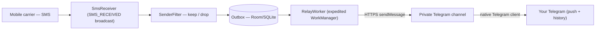

# Puraa — Architecture

This document explains what Puraa is scoped to do and *how* it works internally. All decisions described
here are revisable; significant ones should be lifted into `docs/decisions/`
ADRs as they harden.

---

## 1. System overview

Puraa is a single-purpose Android app that runs on the phone whose SMS you
want to forward. It watches incoming SMS, keeps the ones that match a sender
filter, and forwards each as a plaintext message to **one configured
destination** — a private **Telegram channel** (via a bot) *or* a **Discord
channel** (via a webhook). Exactly one destination is active per install,
never both. You read the messages in a **normal Telegram/Discord client** on
any device — Puraa has no receiving app of its own.

There is deliberately **no encryption** and **no listener/inbox app**. The
message travels TLS-encrypted to the destination and is stored readable in the
channel. This is the whole product: *incoming SMS → your Telegram/Discord*,
nothing more.

### High-level data flow



The design goal alongside correctness is to be **invisible on the
device**: the app is event-driven and holds no long-running process.
Between messages, nothing of Puraa's is running — no foreground
service, no polling loop, no persistent notification. It consumes CPU,
memory, and battery only for the ~1 second it takes to forward a
message, a few times a day.

---

## 2. Scope

### In scope

- Android app (sideloaded APK, no Play Store) installed on the phone whose
  SMS is to be forwarded.
- **One-way forwarding**: that phone → exactly **one** private channel — a
  Telegram channel (via a bot) *or* a Discord channel (via a webhook).
- **Plaintext** messages. TLS protects the hop to the destination; the message
  then sits readable in the private channel. Acceptable for transaction alerts
  (the SMS already travelled over plaintext GSM) — the operator must be
  eyes-open about it, especially for OTPs.
- **Configurable sender filter** per install:
  - *Whitelist mode* (default): forward only SMS from listed sender ids
    (e.g. `HDFCBK`, `SBIINB`, `ICICIB`).
  - *All-SMS mode*: forward every incoming SMS.
- **Only live SMS.** Forwards a message the moment it arrives and **never**
  forwards historical/old SMS — a hard requirement. The one deliberate
  exception is the manual "push last 15 min" backfill (§5).
- **Shared-channel routing.** Any number of relay phones can post into one
  channel; each forwarded message carries the relay's device name for
  attribution.

### Non-goals

- **No listener/inbox app of our own** — messages are read in a normal
  Telegram/Discord client.
- **No encryption** — plaintext only. If sensitive content (e.g. OTPs) is a
  concern, the mitigation is to filter those senders out, not to add crypto.
- **No background footprint** — the app is event-driven and dormant between
  messages (see §10, Reliability).
- **No bidirectional messaging** (destination → SIM).
- **No Play Store distribution, accounts, sign-up, or billing.**
- **No iOS** — iOS does not permit third-party SMS access.
- **No MMS, RCS, or non-SMS notifications** (WhatsApp, etc.).

---

## 3. Success criteria

Objective, testable outcomes for a healthy install:

1. **Latency** — every matching SMS that arrives on the source phone appears in
   the destination channel within ~30 seconds.
2. **Zero-touch** — after the one-time setup, the source phone needs no
   re-opening, restart, or permission re-grant.
3. **Zero footprint** — no noticeable impact on the source phone's performance
   or battery: no always-on service, persistent notification, or polling.
4. **Filter fidelity** — no non-matching SMS is forwarded, unless the install
   is deliberately configured in all-SMS mode.
5. **No backfill** — no historical/old SMS is ever forwarded; only messages
   that arrive after setup.

---

## 4. Destinations

A relay forwards to exactly one destination, chosen at setup (or from a
scanned setup code). Both are one-way "post a message to a channel"
transports, resolved at send time to a single `MessageSink`
(`send/MessageSink.kt`) so the outbox and worker stay destination-agnostic.

| Destination | Transport | Config | Delivered via |
| ----------- | --------- | ------ | ------------- |
| **Telegram** | Bot API `sendMessage` | bot token + channel id | `TelegramClient` |
| **Discord**  | Channel **webhook** `POST {"content": …}` | webhook URL | `DiscordClient` |

Discord needs no bot or gateway — a channel webhook is the direct analog
of a Telegram channel post. The native Discord app push-notifies just like
Telegram. The webhook URL is a secret (anyone with it can post) and is stored
encrypted like the bot token.

### Telegram topology

One **Telegram bot** (`bot_send`) and one **private channel**. The bot is an
admin of the channel with **Post Messages** enabled. Any number of relay
phones can post into the same channel using the same bot token. You subscribe
to that channel in a normal Telegram app and get native push notifications and
full history for free.

| Element        | Role                                                                 |
| -------------- | ------------------------------------------------------------------- |
| `bot_send`     | Admin of the channel with **Post Messages** on. Every relay uses this token. |
| Channel        | Private, invite-only. Holds the message history. Members: `bot_send` (admin), you (subscriber). |
| Relay app      | `POST /bot<TOKEN>/sendMessage` with `chat_id=<channel>` and `text=<rendered SMS>`. |

Per-relayer attribution lives inside the message body (`Device: <relay
name>` line), so a single channel serves any number of relay phones — no need
to slice it per phone.

### Why only one bot now

An earlier design had a second bot and an in-app listener that polled
`getUpdates`. That required two bots (a bot doesn't receive `getUpdates`
for its own posts). With the listener removed and messages read in a normal
Telegram client, the receiving bot and its second `@BotFather` step are gone.
One bot, one token, one channel.

### Why a channel (not a group or DM)

- **DMs**: a bot can't DM a user first; the user must start the chat.
- **Groups**: messier history/privacy semantics.
- **Channels**: broadcast-shaped (one-to-many), and the reader can
  subscribe in a normal Telegram client for free push and history.

---

## 5. Reading SMS

Puraa reads incoming SMS with a **`SMS_RECEIVED` broadcast receiver**
(`SmsReceiver`), holding the `RECEIVE_SMS` permission. The OS delivers the
message — sender, body, timestamp — the instant it arrives.

### Why this, and the "latest only" guarantee

The relay must **only ever forward messages it hears live, never
historical SMS**. The broadcast receiver satisfies this *by construction*:
`SMS_RECEIVED` is an event that fires only for a message arriving now.
There is no query over the SMS database, no "last seen" cursor to keep
correct, and therefore no way to accidentally backfill the phone's SMS
history into the destination. "Send only what we hear" is the only thing this
mechanism *can* do.

Two alternatives were considered and rejected:

| Approach | Why not |
| --- | --- |
| **`ContentObserver` on the SMS provider** (`READ_SMS`) | Works, but "no backfill" depends on seeding a last-seen row id correctly at first run — a bug there dumps the entire SMS history. More moving parts for a property the broadcast gives for free. |
| **`NotificationListenerService`** (read the SMS notification) | Android 14+ redacts sensitive notification content (OTPs) unless you hold a signature-only permission, so bodies can't be read reliably. |

`SMS_RECEIVED` is exempt from the Android 8+ implicit-broadcast
restrictions, so the manifest-registered receiver fires even when the app
isn't running and after a reboot — no boot receiver or always-on process
is needed to keep receiving.

Multipart (long) SMS arrive as several PDUs sharing a sender and
timestamp; `SmsReceiver` concatenates their bodies back into one message.

### Manual "push last 15 min" (the one exception)

The automatic path never reads history. But the status screen has an
explicit **"Push last 15 minutes"** button (`RecentSmsPush`) for catching
up after a gap. Because it reaches *back* in time it must **query the SMS
inbox**, which needs `READ_SMS` — requested lazily on first tap. It pushes
every message in the window **ignoring the sender filter** and **without
de-duplicating** against what may already have been forwarded: a
deliberate, user-initiated "send me everything recent" hammer. This is the
only place Puraa reads the provider, and only on an explicit tap.

---

## 6. Sending SMS

The receiver does the minimum synchronous work — parse, filter, write one
row to the outbox — then returns. The network send happens separately.

### Outbox (Room / SQLite)

Every kept SMS is written to a small `outbox` table before any network
call. This keeps the broadcast handler fast (well under its time limit)
and makes delivery durable: a send can be retried across process death,
network loss, and reboots without losing the message.

### RelayWorker (expedited WorkManager)

Sending is a `CoroutineWorker` scheduled by `SmsReceiver` when a message
is enqueued. It drains the outbox — FIFO — to the destination, marks each row
sent, and stops. Nothing runs between sends.

- **Expedited**: the job runs within seconds even under Doze, so an SMS
  reaches the destination promptly. On Android < 12 WorkManager runs it as a
  brief foreground service (hence a momentary notification and the
  `FOREGROUND_SERVICE*` permissions); on 12+ it runs as an expedited job
  with no notification.
- **Network constraint**: the work is *deferred*, not failed, while
  offline, and drains automatically when connectivity returns.
- **Retry/backoff**: a transient send failure is retried *inside* the
  worker with a short backoff (immediate, +1s, +3s) so a momentary blip
  costs ~1s rather than a full reschedule. Only if those are exhausted
  does the worker return `Result.retry()` and let WorkManager reschedule
  (network constraint + 10s exponential backoff). Work is enqueued with
  `KEEP`, so a new SMS is never chained behind an in-flight or
  backing-off drain — the running worker loops over all ready rows.
- **Bounded**: the outbox is trimmed so a long offline stretch can't grow
  storage without limit; the phone's native SMS inbox remains the source
  of truth.

### Why WorkManager instead of a foreground service

An always-on foreground service (the previous design) sits in memory with
a permanent notification 24/7 just to hold a drain loop. That is the
single biggest thing an SMS forwarder can do to *impact* a phone. Event-
driven expedited work gives the same near-real-time delivery with **zero
idle footprint**, which is the explicit performance goal for this app.

---

## 7. Message (wire) format

The message body is human-readable plaintext:

```
Device: moto g84
From:   HDFCBK
At:     06 Jul 2026, 02:15 PM

Rs 1,234.00 debited from A/c XX1234 on 06-Jul-26.
```

The first three lines are a header (relay device name, SMS sender id,
receive time); everything after the blank line is the SMS body verbatim,
so multi-line messages round-trip exactly. Produced by
`Envelope.encodePlaintext`. There is no encryption and no version byte —
what's on the wire is what the reader sees in Telegram.

---

## 8. Components

```
com.puraa
├── MainActivity            # Compose host: relay setup ↔ relay status
├── PuraaApplication      # Creates the worker's notification channel
├── config/
│   ├── ConfigStore         # EncryptedSharedPreferences — destination + its params, filter, device
│   ├── Destination         # TELEGRAM | DISCORD (exactly one active)
│   ├── SetupCode           # Self-contained "Share setup" QR payload (encode/decode)
│   └── RelaySetup          # Parsed setup fields (destination inferred)
├── relay/
│   ├── SmsReceiver         # BroadcastReceiver for SMS_RECEIVED — the SMS source
│   ├── SenderFilter        # Whitelist / all-SMS decision
│   ├── RecentSmsPush       # Manual "push last 15 min" backfill (reads the inbox)
│   ├── OutboxEntity/Dao    # Room table of pending + sent messages
│   ├── OutboxRepository    # Envelope-encodes and enqueues; drains via the worker
│   ├── RelayWorker         # Expedited WorkManager job that posts via the active sink
│   ├── RelayAnnouncer      # Posts the one-off "configured" confirmation
│   ├── RelayNotifications  # Notification channel + foreground info for the worker
│   └── AppDatabase         # Room database (outbox only)
├── send/
│   └── MessageSink + Sinks # Destination abstraction; resolves the active sink from config
├── telegram/
│   └── TelegramClient      # OkHttp wrapper over Bot API sendMessage
├── discord/
│   └── DiscordClient       # OkHttp wrapper over a channel webhook POST
├── envelope/
│   └── Envelope            # Plaintext wire format (same text for either destination)
└── ui/
    ├── RelaySetupScreen    # Setup form (destination toggle) + QR scan
    ├── RelayScreen         # Running status, stat tiles, "push last 15 min"
    ├── StatusPill          # Active / Inactive status pill (both screens)
    ├── RelayPermissions    # Runtime-permission + battery-exemption helpers
    └── theme/              # Color, Theme, Type
```

---

## 9. Local storage

- **`EncryptedSharedPreferences`** (hardware-backed, Android Jetpack
  Security): the active destination and its secrets — Telegram bot token +
  channel id, or the Discord webhook URL — plus the sender whitelist, relay
  device name, and a `relayActive` flag (whether the relay is running or
  paused — see §11).
- **Room / SQLite** (`puraa.db`): the `outbox` table. Pending rows survive
  reboots; a failed row backs off and is parked as `FAILED` after `MAX_ATTEMPTS`
  (6) so it can't block the queue; the last **20 terminal rows** (`SENT` and
  `FAILED` combined) are retained (unencrypted, app-private), older ones
  trimmed, and the "Recent activity" list shows the most recent 10 of them.
  Room migrations preserve the outbox across app updates (no destructive
  fallback).

Nothing is stored off-device. The SMS body already lives in the phone's
native SMS app; the outbox holds a copy of recent messages (queued plus the
last 20 terminal rows) in app-private storage. Backups are disabled, so this is
exposed only to physical/rooted access — which the threat model accepts.

---

## 10. Reliability

| Concern                | How it's handled                                                        |
| ---------------------- | ----------------------------------------------------------------------- |
| App not running        | `SMS_RECEIVED` is a manifest broadcast, exempt from background limits — it wakes the app. |
| Device reboot          | Manifest receiver works post-boot; WorkManager reschedules pending sends itself. No boot receiver needed. |
| Network down           | WorkManager network constraint defers the send; it drains on reconnect. |
| Send failure           | Fast in-worker retries (immediate/+1s/+3s) absorb transient blips; only persistent failures fall back to `Result.retry()` → WorkManager 10s backoff. |
| Telegram rate limit    | SMS volume is far below Telegram's limits; the FIFO drain is naturally paced. |
| Doze / App Standby     | Expedited work runs promptly even in Doze. Target devices are stock Motorola (no aggressive OEM killers). |
| Storage growth offline | Outbox trimmed to a bounded size; native SMS inbox is the source of truth. |

An optional **battery-optimisation exemption** is requested at setup to
keep sends prompt on idle phones; it is belt-and-suspenders, not required
for correctness.

---

## 11. Configuration and onboarding

### One-time Telegram setup

1. In `@BotFather`: create one bot; save its token.
2. Create one private channel.
3. Add the bot to the channel as an admin with **Post Messages** on.
4. Capture the channel id (e.g. `-1001234567890`).

### Relay setup (on the source phone)

First launch opens the relay setup screen directly (there is only one
mode). The screen has a **Telegram / Discord** toggle that swaps between
the token+channel fields and a single webhook field, plus a device name and
optional sender whitelist. Fill these in and tap **Save**, granting
`RECEIVE_SMS` (and notification permission on Android 13+).

The secrets don't have to be typed, though. Besides manual entry there is
exactly one shortcut — **scan a setup QR** (a button on the setup screen).
Another phone's "Share setup (QR)" shows a QR of its config; scanning it
**pre-fills the form for review and Save** (that Save is the confirmation, and
the only action that ever writes config). The QR carries a **self-contained
Puraa setup code** — not a URL and not a deep link, so a generic scanner sees
only opaque text and nothing routes anywhere. Because only an in-person camera
scan applies it, there is no remote path to inject config. A Discord webhook
must be a real Discord host (`discord.com` / `discordapp.com`) to save, so
config can't be pointed elsewhere either way.

These are the **only two** ways to configure the relay: manual entry or an
in-person QR scan. Puraa deliberately registers **no deep link / VIEW
handler**, so there is no exported, remotely-deliverable link an attacker
could craft to re-point a relay.

The only OS prompt is the `RECEIVE_SMS` dialog, which Android mandates.

### Running vs. paused (Stop and reconfigure)

Config has two independent facts: whether it is *configured* (has valid
destination + secrets) and whether it is *running*. `ConfigStore.relayActive`
tracks the latter; `isRelayRunning() = isRelayConfigured() && relayActive` is
the single gate for both routing (which screen shows) and forwarding
(`SmsReceiver` / `RecentSmsPush`). Saving a valid setup sets `relayActive`
true.

**Stop and reconfigure** (a menu action on the running screen) sets
`relayActive = false` and clears the pending queue, but **keeps** the
destination, token/webhook, filter, and device name. So a mistaken stop is
undone by re-saving the setup form, which comes back **pre-filled** with the
previous values — no secret has to be re-entered. A paused relay opens to the
setup screen on next launch.

The status is surfaced by a **status pill** (`ui/StatusPill`): a teal
"Active" on the running screen, a muted "Inactive" on the setup screen.

### Configuration confirmation

On Save, the relay posts a one-off confirmation to the destination through
the normal outbox + `RelayWorker` path:

```
✅ Puraa relay configured
Device: moto g84
Destination: Telegram
Filter: HDFCBK, ICICIB, CRED
This phone will now forward matching SMS here.
```

This gives immediate proof — in whichever destination is active — that the
phone is live and with which settings. The bot token / webhook URL is never
included; it's a secret and the channel already implies it.

### Setup QR code

The QR is a **self-contained setup code** (`config/SetupCode.kt`) — not a
URL and not a deep link: a magic header line plus newline-delimited
`key=value` fields, understood only by Puraa's own scan flow. A generic QR
scanner sees opaque text and can do nothing with it; there is no dependency
on any website and nothing for the OS to route.

```
PURAA-SETUP/1        PURAA-SETUP/1
bot=<token>          discord=<webhook_url>
ch=<channel-id>      filter=<csv>          # filter omitted when empty
filter=<csv>
```

Values need no escaping — newline is the only delimiter and none of the
values (token, channel id, webhook URL, CSV filter) contain one. The device
name is never encoded; the scanning phone names itself.

**No deep link, by design.** An earlier iteration also accepted a
`puraa://relay?…` custom-scheme link (and briefly an `https://…` App Link).
Both were removed: an `exported` + `BROWSABLE` VIEW handler is *remotely
deliverable* — an attacker who knows the scheme can plant a tappable link in a
page/message/email, and one careless tap-then-Save on the phone would re-point
its relay. Even though a link never configured silently, the handler itself
was the attack surface. With it gone, the app doesn't register as a handler at
all, so a crafted link resolves to nothing. Configuration is manual entry or
an in-person QR scan, full stop.

---

## 12. Permissions

| Permission | Why |
| --- | --- |
| `RECEIVE_SMS` | Read incoming SMS the instant they arrive (the automatic path). |
| `READ_SMS` | Query the inbox for the manual "push last 15 min" backfill only; requested lazily on first tap. |
| `CAMERA` | Scan a setup QR code; requested only when you tap "Scan setup QR code". |
| `INTERNET`, `ACCESS_NETWORK_STATE` | Post to the destination; gate on connectivity. |
| `FOREGROUND_SERVICE`, `FOREGROUND_SERVICE_DATA_SYNC` | WorkManager's brief foreground window for expedited sends on Android < 12. |
| `POST_NOTIFICATIONS` | Show that brief foreground notification on Android 13+. |
| `REQUEST_IGNORE_BATTERY_OPTIMIZATIONS` | Keep sends prompt on idle phones (optional). |

Notably **not** requested: notification-listener access and
`RECEIVE_BOOT_COMPLETED`.

---

## 13. Threat model (brief)

Puraa is a convenience tool, not a security product. In plaintext mode:

| Threat | Covered? |
| --- | --- |
| Network attacker between phone and destination | **Yes** — TLS to `api.telegram.org` / `discord.com`. |
| The destination service, or someone with server/channel access | **No** — they see the plaintext SMS. Acceptable for transaction alerts; be eyes-open about OTPs. |
| Malicious app or QR injecting config | **Mitigated** — a QR only *pre-fills* the setup screen; config is written solely by an explicit user Save; there is no deep link at all; Discord webhooks are host-validated to a Discord host (`discord.com` / `discordapp.com`). |
| Secret (bot token / webhook URL) leaked from the APK or a shared QR | Partial — an attacker could post to / drain the channel. Rotate the bot token via `@BotFather` or regenerate the Discord webhook. |
| Physical access to a rooted phone | **No** — the secret and queued/recent messages are on the device. |

The main practical risk is **secret leakage** (bot token or webhook URL),
not broken transport — especially via a shared setup QR. Keep the channel
invite-only, treat the token/webhook as secrets (delete setup material after
use, rotate if exposed), and consider excluding OTP senders from the whitelist
since OTPs are live credentials.
